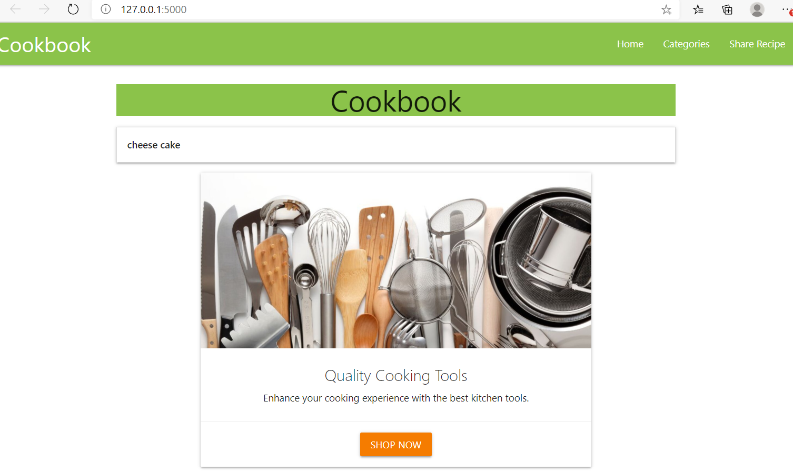
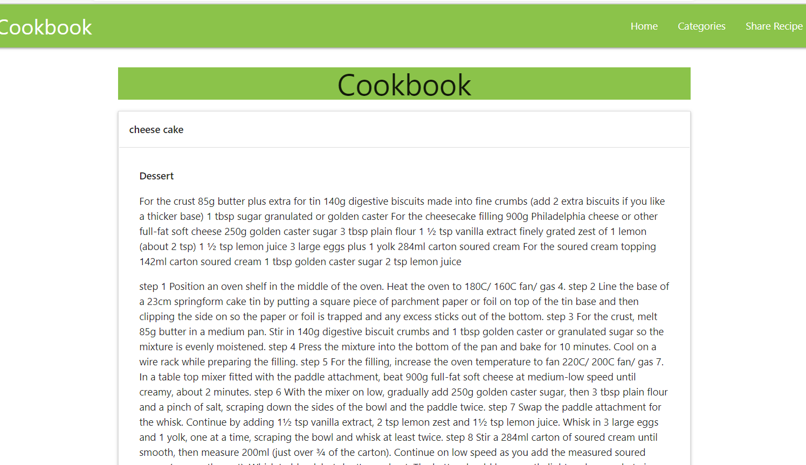
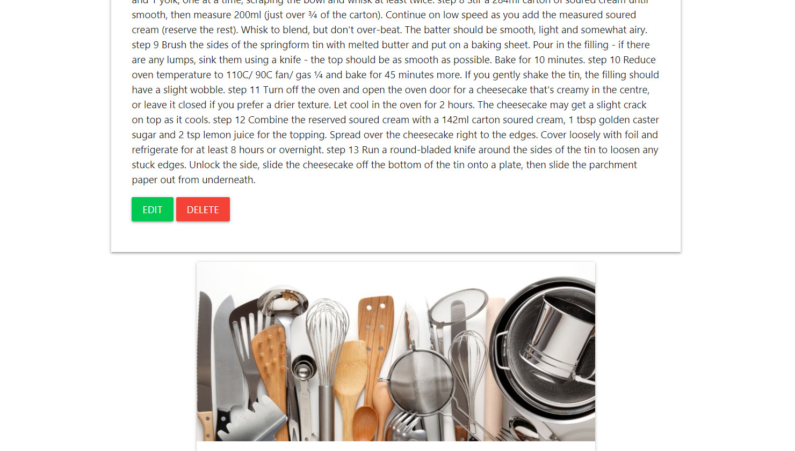
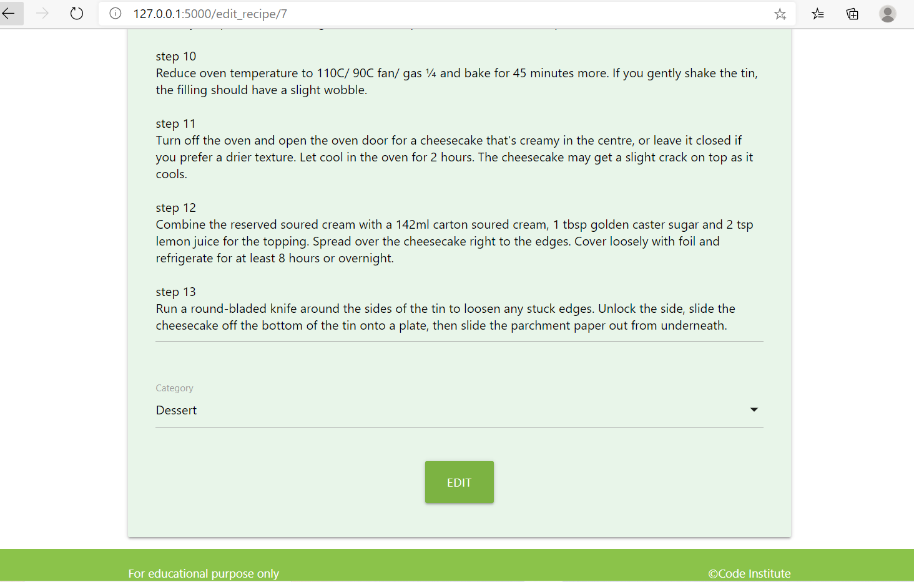
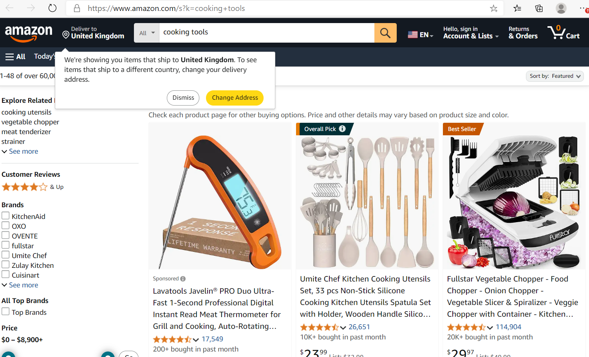

# project3 Cookbook

## Background information
Cookbook is a simple web application that allows users to browse and contribute recipes. The website organizes recipes into categories, making it easy for users to find and share their favorite dishes. Users can view, edit and delete both categories and recipes without logging in.They also can purchase kitchen tools by clicking a link on the home page which direct them to Amazon. 

### Goals
- External user’s goal: Find and share recipes.
- Site owner's goal: to promote a brand of cooking tools.

### User stories
- First Time Visitor Goals
  1. As a First Time Visitor, I want to easily understand the main purpose of the site.
  2. As a First Time Visitor, I want to be able to easily navigate throughout the site to find information.
- Returning Visitor Goals
  1. Search for recipes according to categories, view relevant information about ingredients and instructions.
  2. Share recipes according to categories, write relevant information about ingredients and instructions.
  3. Buy kitchen tools from Amazon which is directed by this website.
- Frequent Visitor Goals
  1. Search for recipes according to categories, view relevant information about ingredients and instructions.
  2. Share recipes according to categories, write relevant information about ingredients and instructions.
  3. Buy kitchen tools from Amazon which is directed by this website.

## Features

### Homepage
- A clean and simple layout without a hero section.
- Recipes are listed in collapsible cards. Users can edit or delete recipes, once the full recipe is shown up.
- A promotional section for cooking tools, linking to Amazon.

### Categories Page 
- Users can create recipe categories (e.g., Italian, Vegan, Desserts) by clicking 'Add Category'.
- Recipes are organized under these categories.
- Users can view, edit and delete categories by clicking corresponding buttons.

### Share Recipe Pages
- Each recipe page includes:
  - Title
  - Ingredients
  - instructions
- By filling the form and clicking 'ADD' button, users share their recipe.

### Search Functionality
- Users can search for recipes by category.

### User Interaction
- All users can browse recipes without signing in.
- Any user can edit or delete recipes or categories.

## Technologies Used
- **Frontend:** HTML, CSS (Materialize Framework)
- **Backend:** Flask (Python)
- **Database:** PostgreSQL
- **Deployment:** [Add if applicable]

## Design

### Color Scheme
The color scheme for this website is designed to be clean, simple and represent healthy eating, with a focus on readability.

- **Background Color**: The background is set to **white** (#FFFFFF) to provide a clean, minimalistic look, ensuring that the content remains the focal point.
- **Primary Color**: The main accents of the website are in **green** and **light green**. They are used for navigation bar and footer, giving out a healthy eating vibe and guiding the user’s attention.
- **Text Color**: The primary font color is **black** (#000000) for optimal contrast against the white background, ensuring readability across all devices and environments.

This simple color scheme enhances the user experience by focusing on clarity, ease of navigation, and visual comfort.

### Typography:

In this project, I used the default **Materialize** font stack for the app's typography. The Materialize framework uses a set of system fonts to ensure excellent performance, wide compatibility, and consistent readability across various devices and platforms.

- The font stack is made up of:
  - `-apple-system` (for Apple devices)
  - `BlinkMacSystemFont` (for browsers on macOS)
  - `Segoe UI` (for Windows devices)
  - `Roboto` (commonly used for Android and modern browsers)
  - `Ubuntu`, `Cantarell`, `Helvetica Neue`, `sans-serif` (additional fallback options)

By relying on system fonts, Materialize avoids loading external fonts, which improves the performance and speed of the app. The result is a clean, readable experience across desktop and mobile devices.

## Testing
### Validator Testing
- The W3C Markup Validator and W3C CSS Validator Services were used to validate every page of the project to ensure there were no syntax errors in the project.
### Webpage Testing 

- **Homepage**
This test ensures that all key elements on the homepage work correctly, including navigation, promotions, and recipe listings
- **Expected Results**
1. Navigation links should direct users to the correct pages (Share Recipe, Categories).
2. The promotional picture should load properly.
3. Clicking the "Shop Now" button should open the Amazon page.
4. Recipes should be displayed inside collapsible cards.
5. Clicking a recipe card should expand/collapse the details.
6. Edit and Delete buttons should appear on each recipe card and function correctly.
- **Actual Results**

1. Navigation links are working correctly.
2. The promotional image loads properly.
3. Recipes display correctly inside collapsible cards.
4. Clicking a card expands/collapses the recipe details as expected.

5. Edit and Delete buttons appear on each recipe card and function correctly.

6. The "Shop Now" button redirects to Amazon as expected.

- **Categories Page**

__Test Validation__
- **Steps**
  1. Leave the bar empty.
  2. Click 'Search'.
- **Expected Result:** 
  Error messages should appear for missing fields.

__Test Responsiveness__
- **Steps:** 
  1. Use Search on different devices (e.g., phone, tablet, desktop).
- **Expected Result:** 
  The map should be easy to use on all devices.
### Top offers Testing
__Test submission__
- **Steps**
  1. Click "Buy Now" button.
  2. Fill out the form with valid details.
  3. Click 'Submit'.
- **Expected Results**
  You should see a confirmation message.

__Test Validation__
- **Steps**
  1. Leave some required fields empty.
  2. Click 'Submit'.
- **Expected Result:** 
 Error messages should appear for missing fields.

__Test Responsiveness__
- **Steps:** 
  1. Use Buy Now button on different devices (e.g., phone, tablet, desktop).
- **Expected Result:** 
  It should be easy to use on all devices.
    
__Report Issues__
- **Contact:** Email [wendytanvalencia@gmail.com].
